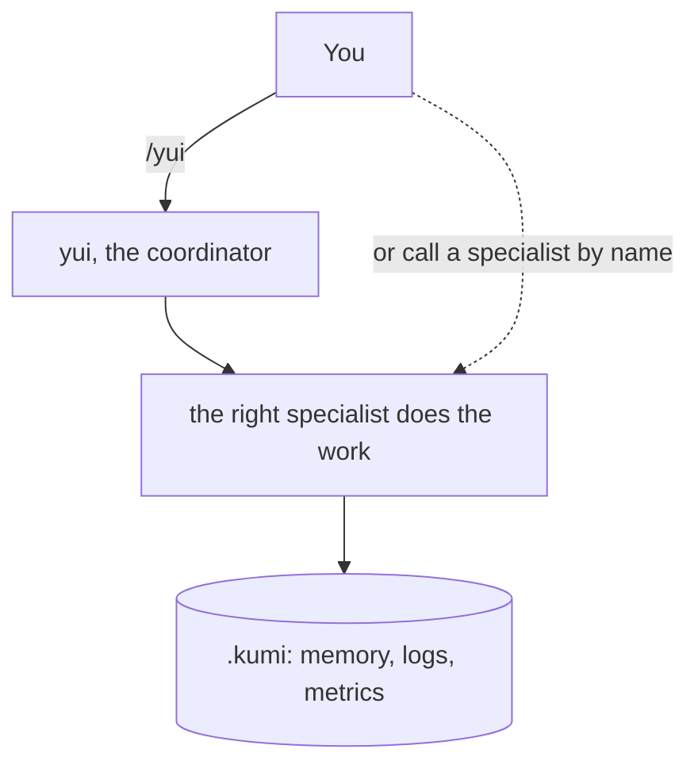

# kumi

_A coordinated engineering team that remembers._


**kumi** (組, "a team") gives you a full engineering team as named specialists, and it does one thing most agent setups do not: it remembers your project between sessions. Work does not start cold every time. What the team decided and where it left off is captured when a session ends and brought back when the next one starts.

Call **yui**, the coordinator, to route a task to the right specialist or run a feature end to end, or call any specialist directly by name when you already know who you need.

Every specialist follows the same discipline. Read the context first, make the smallest correct change, verify. Debuggers find the root cause before touching anything. Reviewers are read-only and rank findings by severity. The shared discipline is what makes them a team rather than a pile of prompts.

## Install

In Claude Code:

```bash
claude plugin marketplace add annavetech/kumi
claude plugin install kumi@kumi
```

## Meet the team

Call the coordinator to route work, or any specialist directly.

**Coordinator**

| Name | Call | Role |
|------|------|------|
| **yui** | `/yui` | Routes work, or runs a feature end to end |

### Go

| Name | Call | Role |
|------|------|------|
| **jaan** | `/jaan` | Implementer |
| **siim** | `/siim` | Debugger |
| **mart** | `/mart` | Reviewer (read-only) |

### Angular

| Name | Call | Role |
|------|------|------|
| **liis** | `/liis` | Implementer |
| **kadi** | `/kadi` | Debugger |
| **tiiu** | `/tiiu` | Reviewer (read-only) |

### iOS (Swift/SwiftUI)

| Name | Call | Role |
|------|------|------|
| **ren** | `/ren` | Implementer |
| **shu** | `/shu` | Debugger |
| **ryo** | `/ryo` | Reviewer (read-only) |

### Python

| Name | Call | Role |
|------|------|------|
| **eero** | `/eero` | Implementer |
| **anu** | `/anu` | Debugger |
| **ivo** | `/ivo` | Reviewer (read-only) |

### React

| Name | Call | Role |
|------|------|------|
| **noa** | `/noa` | Implementer |
| **rui** | `/rui` | Debugger |
| **aki** | `/aki` | Reviewer (read-only) |

### Data

| Name | Call | Role |
|------|------|------|
| **saku** | `/saku` | SQL specialist |
| **remo** | `/remo` | NoSQL specialist |

### Cross-cutting

| Name | Call | Role |
|------|------|------|
| **kai** | `/kai` | Architect, for any stack |
| **enn** | `/enn` | Process manager |

The names are short on purpose. Once you know the team you call them the way you would call a colleague: `/jaan, add the endpoint`, `/mart, review it`, `/siim, this test is failing`.

Every specialist ships two ways. As a **skill** you invoke by name in your session, and as a **subagent** that runs in its own context. The skill is the source of truth; the subagent is generated from it, so the two never drift.

## How it works

The coordinator (`yui`) reads a role table and dispatches to the right specialist. It never does the work itself. For a feature that spans design, build, and review, `yui` sequences the specialists (for example `kai` designs, `jaan` builds, `mart` reviews) and passes context between them through a shared handoff.



## Cross-session memory

This is the piece most agent setups lack. Two bundled hooks form a loop:

- When an agent stops, one hook writes the current handoff and decisions to an append-only `.kumi/memory/log.md`.
- When a new session starts, another hook reads the recent memory back in, so the session resumes where the last one left off.

Capture is driven by the runtime, not by an agent remembering to save, so it is reliable rather than best-effort. See [docs/MEMORY.md](docs/MEMORY.md).

## Logging and metrics

kumi can also show you what the team did and what it cost. When a project uses the shared state, two more hooks run:

- An activity log records each tool action with a timestamp.
- A metrics recorder captures token and time usage per session, and per agent for the specialists that run as subagents.

Both are off unless the project has a `.kumi` directory, so they stay silent everywhere else. See [docs/OBSERVABILITY.md](docs/OBSERVABILITY.md).

## Configuration

kumi works with no setup. Two optional knobs let you tune it, both without editing any source file.

- **Where state lives.** By default kumi keeps its memory, logs, and metrics in a `.kumi` directory inside the project. Set the `KUMI_STATE_DIR` environment variable to move it: an absolute path keeps everything in one place across projects, a relative path is taken from the project root.
- **House rules.** Drop an `overrides.json` in the state directory to add or change rules for the team. Rules under `all` apply to everyone, rules under a specialist's name apply to that one, and kumi reads them at the start of a session and applies them on top of the built-in discipline. See [config/overrides.example.json](config/overrides.example.json) for a template.

## The uniform structure

kumi is built like a small framework, not a bag of prompts. Every specialist follows the same contract: the same frontmatter and the same fixed sections (role, a hard gate, an anti-pattern, an ordered checklist, a process flow, a handoff, key principles, tone). Read one skill and you understand all of them.

Extending it is mechanical. Adding a specialist takes three steps:

1. Copy `template/skill-template/SKILL.md` into `skills/<name>/SKILL.md` and fill the fixed sections.
2. Add one row to the team table in `skills/yui/SKILL.md`.
3. Run `python3 scripts/build_agents.py` to generate its subagent, and `python3 tests/run_tests.py` to confirm it conforms.

Nothing else changes. The coordinator only knows the role table, and no specialist knows another's internals. The team grows without any part being rewritten. For a full worked example, see [docs/WALKTHROUGH-ADD-PHP-AGENT.md](docs/WALKTHROUGH-ADD-PHP-AGENT.md).

## Usage examples

```
/yui build a REST endpoint that lists projects, with tests
```
yui routes: `kai` designs the shape, `jaan` implements, `mart` reviews.

```
/anu this pytest fails with a KeyError in the parser
```
anu reproduces, finds the root cause, states the fix, applies it, and verifies.

```
/aki review the orders dashboard before I ship it
```
aki returns a ranked, read-only findings list.

## Read more

- [skills/README.md](skills/README.md): the roster of every specialist and how they relate.
- [docs/CAST.md](docs/CAST.md): who the specialists are, and where their names come from.
- [docs/ANATOMY.md](docs/ANATOMY.md): what makes up one specialist and the whole package.
- [docs/ARCHITECTURE.md](docs/ARCHITECTURE.md): how the framework is built.
- [docs/DIAGRAMS.md](docs/DIAGRAMS.md): all the diagrams.
- [docs/MEMORY.md](docs/MEMORY.md): how the team remembers work between sessions.
- [docs/OBSERVABILITY.md](docs/OBSERVABILITY.md): logging and metrics.
- [docs/MANAGING-SPECIALISTS.md](docs/MANAGING-SPECIALISTS.md): how to add, disable, modify, remove, or rename a specialist.
- [docs/WALKTHROUGH-ADD-PHP-AGENT.md](docs/WALKTHROUGH-ADD-PHP-AGENT.md): a full worked example of adding one.
- [examples/](examples/): worked transcripts.
- [evals/](evals/): the routing set the team is tested against.
- [CONTRIBUTING.md](CONTRIBUTING.md) and [CHANGELOG.md](CHANGELOG.md).

## License

MIT, see [LICENSE](LICENSE).
