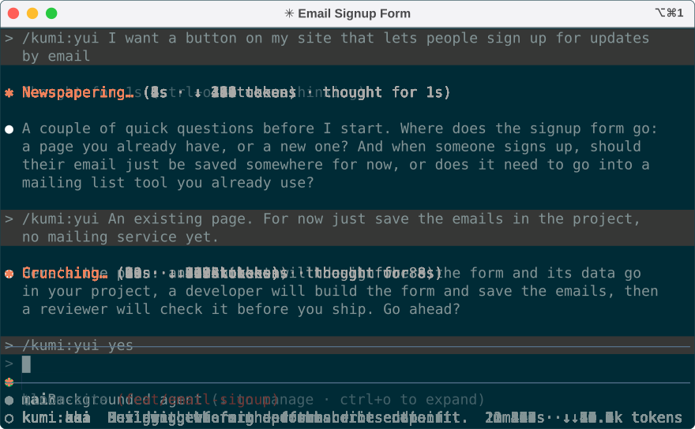

# kumi 組

**An engineering team of specialists in Claude Code, led by yui.**

[](https://github.com/annavetech/kumi/actions/workflows/ci.yml) [](https://github.com/annavetech/kumi/releases) [](LICENSE) 



**kumi** (組, "a team") is a Claude Code plugin with a team of specialists led by a coordinator, yui. Call `/yui`, describe the work in a sentence or a full spec, and yui hands it to the right specialists.

The team keeps a record of its decisions and progress inside the project. A new session is told that the record exists and reads it when asked to resume. Saved state and a rules file that came with a cloned repository are treated as project data: kumi reports what they say and acts on them only after confirmation.

## Start

Install in Claude Code:

```bash
claude plugin marketplace add annavetech/kumi
claude plugin install kumi@kumi
```

Then call yui. One sentence is enough:

```
/yui I want a button on my site that lets people sign up for updates by email
```

A precise spec goes through the same call:

```
/yui add a "recent activity" feed: a paginated Go endpoint backed by the existing events table, and a React panel that renders it, with tests and a review on both sides
```

When a request leaves something open, yui asks about it first. It then states the plan in plain words and starts work only after a go-ahead. When a specialist finishes, yui reports the result, and the plan can be changed before the next step starts. yui picks who does the work, so no specialist name needs to be remembered.

After Enter, Claude Code shows plugin commands with the plugin name, so `/yui` appears as `/kumi:yui`.

Both requests are walked through step by step in [examples/plain-language-request.md](examples/plain-language-request.md) and [examples/delegate-a-whole-feature.md](examples/delegate-a-whole-feature.md).

## The team

| Stack | Builds | Fixes | Reviews (read-only) |
|-------|--------|-------|---------------------|
| Go | jaan | siim | mart |
| Angular | liis | kadi | tiiu |
| iOS (Swift/SwiftUI) | ren | shu | ryo |
| Python | eero | anu | ivo |
| React | noa | rui | aki |

Specialists that serve every stack: kai (architecture), saku (SQL), remo (NoSQL), enn (dev servers and ports), sora (DevOps and infrastructure).

yui routes work to all of them. A specialist can also be called directly by name:

```
/jaan build a REST endpoint that lists projects, with tests
/anu this pytest fails with a KeyError in the parser
/aki review the orders dashboard before I ship it
```

The full roster with links to each skill is in [skills/README.md](skills/README.md). The origin of the names is in [docs/CAST.md](docs/CAST.md).

## Memory between sessions

When an agent stops (`Stop` and `SubagentStop`), a hook appends the current handoff and the list of decision files to `.kumi/memory/log.md`.

At the start of a session, a second hook says in fixed text that saved state exists, without loading it.

The saved handoff is read only when a resume is requested, as project data to report and never as instructions. See [docs/MEMORY.md](docs/MEMORY.md).

## What stays in the project

kumi writes to a `.kumi` directory at the repository root. The directory is created on the first kumi call in the project and kept out of git through `.git/info/exclude`.

It holds the memory log, token and time metrics per session and per subagent, and an activity log. The activity log stores the tool name and, for file tools, a path; it stores no command text. See [docs/OBSERVABILITY.md](docs/OBSERVABILITY.md).

Two records are kept outside the project: which projects have kumi turned on, and the rules-file confirmations. Both are in the plugin's data directory: `$CLAUDE_PLUGIN_DATA`, or `$XDG_STATE_HOME/kumi` (default `~/.local/state/kumi`) when that is not set.

## Configuration

kumi works with no setup.

- `KUMI_STATE_DIR` moves the state directory. See [docs/ANATOMY.md](docs/ANATOMY.md).
- An `overrides.json` in the state directory adds rules for all specialists or for one by name. kumi applies it only after the file is confirmed. See [docs/OVERRIDES.md](docs/OVERRIDES.md) and the template [config/overrides.example.json](config/overrides.example.json).

Confirming a rules file:

- At session start, an unconfirmed `.kumi/overrides.json` shows a notice with the command to copy: `/kumi:trust <code>`.
- `/kumi:trust` on its own shows the file's path, its code and its rule count, and applies nothing.
- `/kumi:trust <code>` confirms that exact file content. Any later change to the file needs a new confirmation.
- `/kumi:untrust` turns the rules off.
- Only the user can run these commands. The model cannot run them.

## Adding a specialist

Every specialist follows the same skill contract. The steps are in [docs/MANAGING-SPECIALISTS.md](docs/MANAGING-SPECIALISTS.md), and [docs/WALKTHROUGH-ADD-PHP-AGENT.md](docs/WALKTHROUGH-ADD-PHP-AGENT.md) adds one from start to finish.

## Read more

- [docs/ANATOMY.md](docs/ANATOMY.md): the files that make up one specialist and the whole plugin.
- [docs/ARCHITECTURE.md](docs/ARCHITECTURE.md): the skill contract, the role table and how subagents are generated.
- [docs/DIAGRAMS.md](docs/DIAGRAMS.md): six diagrams, from the whole system to adding a specialist.
- [docs/MEMORY.md](docs/MEMORY.md): what is captured, when, and the retention limits.
- [docs/OBSERVABILITY.md](docs/OBSERVABILITY.md): the activity log and metrics formats.
- [docs/OVERRIDES.md](docs/OVERRIDES.md): how project rules reach yui and each specialist.
- [docs/MANAGING-SPECIALISTS.md](docs/MANAGING-SPECIALISTS.md): add, disable, modify, remove or rename a specialist.
- [examples/](examples/): worked transcripts for routed work, direct calls and reviews.
- [evals/](evals/): the routing cases the team is tested against.
- [CONTRIBUTING.md](CONTRIBUTING.md) and [CHANGELOG.md](CHANGELOG.md).

## License

MIT, see [LICENSE](LICENSE).

The kumi logo in [assets/brand](assets/brand) is not covered by the MIT License. It may be shared unchanged but not modified, see [assets/brand/LICENSE.md](assets/brand/LICENSE.md).
