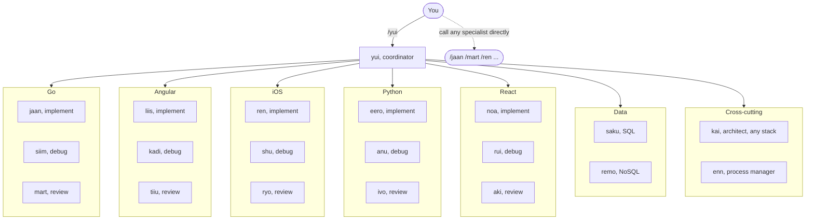
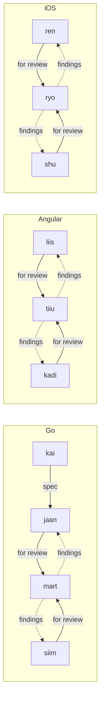
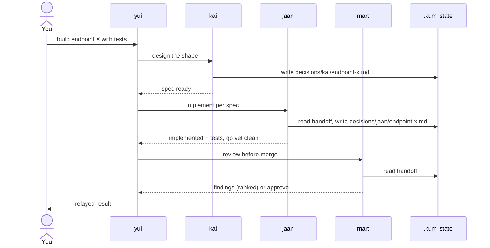
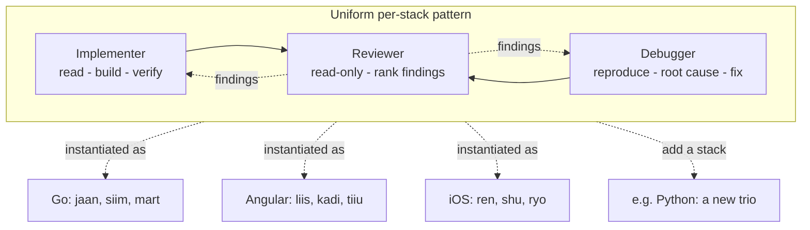
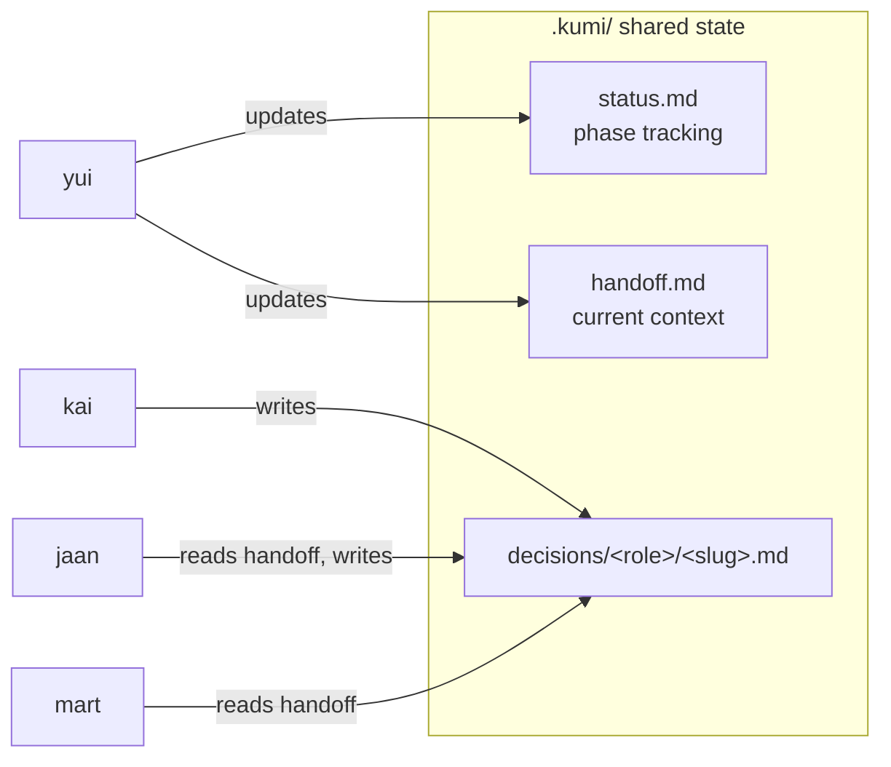
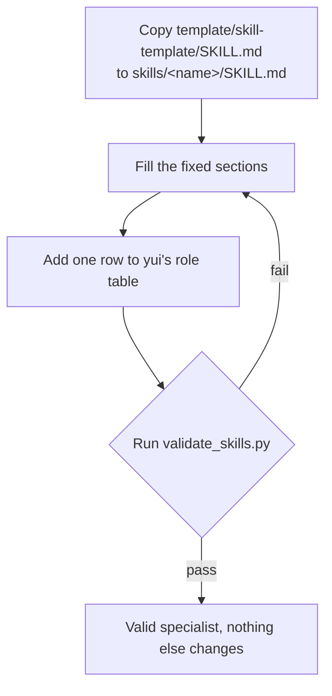

# kumi diagrams

All diagrams are Mermaid, so they are diagrams-as-code: the source lives in this file and GitHub renders them with no build step. Each diagram is one level of the system, from the whole team down to how a single specialist runs and how you add a new one.

## 1. The whole system

The top level. You call `yui`, the coordinator, and it routes to the right specialist. You can also call any specialist directly by name.

## 2. How specialists hand off

Specialists are not isolated. Within a stack, work flows design -> implement -> review, and debug -> review. The coordinator sequences these; the arrows show the natural handoffs.

## 3. A feature, end to end

A concrete multi-role task, "build a new endpoint with tests", as the coordinator sequences design, build, and review, passing context through shared state.

## 4. The uniform triad (why the team is consistent)

Each language stack is the same shape: an implementer, a debugger, a reviewer. Learn one stack and you know how the others relate. Adding a new stack is adding another trio.

## 5. Shared state

For multi-role work, roles communicate only through a uniform state format under `.kumi/` in the working project. No role reads another role's internals; they read the handoff.

## 6. Adding a specialist

Adding a role is mechanical because of the uniform contract. Three steps, and the validator is the gate.

Nothing else in the plugin changes: the coordinator only learns the new role table row, and no existing specialist is touched.
